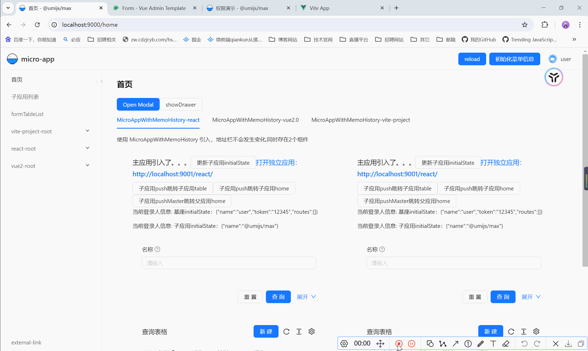

# micro-app

以 umi4.0 选择 Ant Design Pro 作为基座搭建的微应用

dev 效果预览：

prd 效果预览：

main、react:

- umi 4.0
- antd 5.0
- pro-components 2.0

vue-admin-template:

- vue 2.0
- vue-router 3.0
- vuex 3.0
- element-ui 2.0

engines:

- node 16.18
- pnpm 8.1
- npm 8.19

start:

- 安装：进入各项目运行 pnpm i
- 启动：进入 cd scripts, 执行脚本 ./start.sh
- 打包：进入 cd scripts, 执行脚本 ./build.sh
- nginx 部署：查看主项目/table 页面
